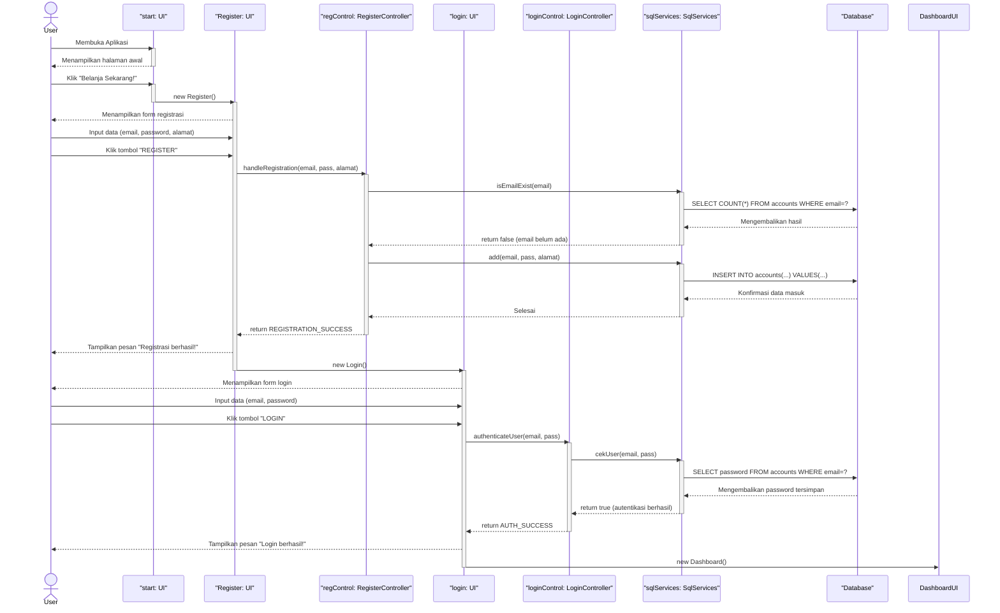
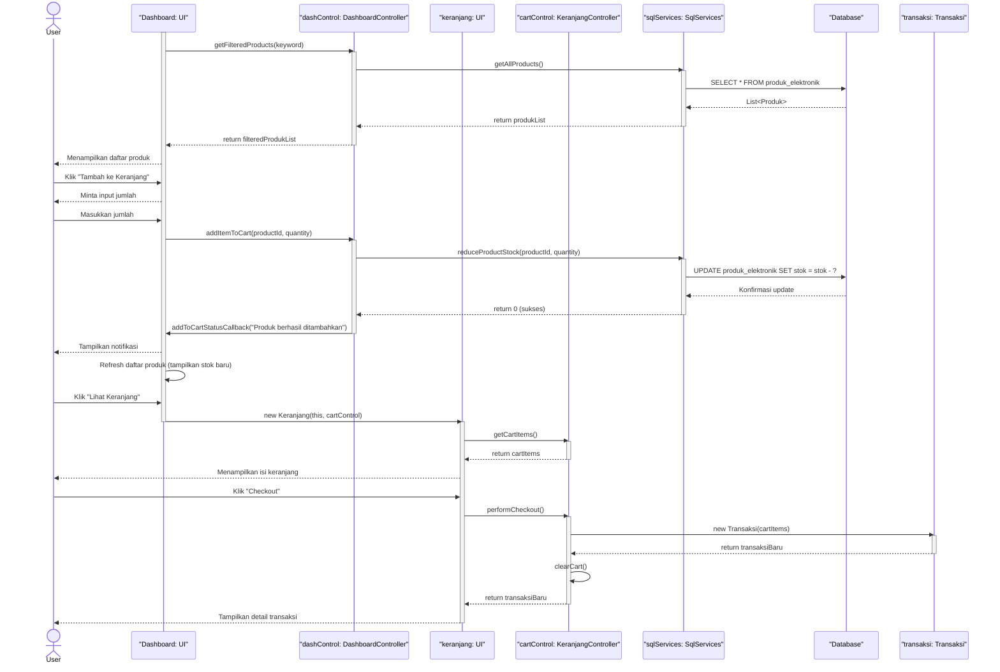

# !!!ALLERT!!!
### Untuk akses ke database, buka file config.propertis di folder src dan masukan data local sql kalian 
```properties
    #Database Configuration
    db.url=jdbc:mysql://localhost:{port}/{schema}
    db.user={biasanya root}
    db.password={password kalian}
    JDBC Driver
    #db.driver=com.mysql.cj.jdbc.Driver
```
### Ganti tiap {...} dengan data kalian
___

# <div align="center">Sequence Diagram Login</div>


<br>
<br>

# <div align="center">Sequece Diagram CRUD Barang</div>
