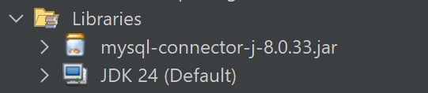

# <div align="center">======== !!!PERHATIAN!!! =========</div>
___

### Dummy data. Tambahkan ke schema database yang sudah ada
```sql
-- untuk membuat tabel accounts
drop table accounts;
create table accounts (
	email varchar(255) primary key,
    password varchar(15) not null,
    alamat varchar(255) not null,
    money int default 0
);

-- insert dummy data untuk accounts
INSERT INTO accounts (email, password, alamat,money) VALUES
('sirils@gmail.com', 'siriel', 'jakarta 123' ,500),
('ungguls@gmail.com', 'unggul', 'hadehh',120),
('regins@gmail.com', 'regina', 'mana aja boleh',1000),
('ninabae@gmail.com', 'ninskuy', 'dahlah',2000),
('takikun@gmail.com', 'taktak', 'wes ah',10);

-- untuk membuat tabel produk_elektronik
CREATE TABLE produk_elektronik (
    id INT AUTO_INCREMENT PRIMARY KEY,
    nama_produk VARCHAR(255) NOT NULL,
    kategori VARCHAR(100),
    sku VARCHAR(50) UNIQUE,
    deskripsi TEXT,
    harga DECIMAL(10, 2),accounts
    stok INT
);

-- insert dummy data untuk produk_elektronik
INSERT INTO produk_elektronik (nama_produk, kategori, sku, deskripsi, harga, stok) VALUES
('Arduino Uno R3', 'Mikrokontroler', 'SKU-UNO-R3', 'Papan pengembangan mikrokontroler berbasis ATmega328P.', 125000.00, 50),
('ESP32-WROOM-32', 'Mikrokontroler', 'SKU-ESP-32', 'Modul mikrokontroler dengan WiFi dan Bluetooth terintegrasi.', 95000.00, 75),
('Sensor Suhu DHT11', 'Sensor', 'SKU-DHT-11', 'Sensor untuk mengukur suhu dan kelembapan udara.', 15000.00, 200),
('Modul Relay 2 Channel', 'Modul', 'SKU-RLY-02', 'Modul relay dengan 2 channel untuk mengendalikan perangkat AC/DC.', 25000.00, 150),
('Motor Servo SG90', 'Aktuator', 'SKU-SRV-90', 'Motor servo kecil untuk proyek robotika dan otomasi.', 18000.00, 300),
('Sensor Ultrasonik HC-SR04', 'Sensor', 'SKU-HC-SR04', 'Sensor untuk mengukur jarak menggunakan gelombang ultrasonik.', 12000.00, 250),
('Resistor Kit (300 pcs)', 'Komponen Pasif', 'SKU-RES-KIT', 'Kumpulan resistor dengan berbagai nilai resistansi.', 35000.00, 100),
('LED Kit (100 pcs)', 'Komponen Pasif', 'SKU-LED-KIT', 'Kumpulan LED dengan berbagai warna.', 20000.00, 180),
('Breadboard 830 Point', 'Alat Prototipe', 'SKU-BRD-830', 'Papan roti untuk merakit sirkuit elektronik tanpa solder.', 22000.00, 120),
('Kabel Jumper Male-to-Male', 'Aksesori', 'SKU-JMP-MM', 'Satu set kabel jumper untuk menghubungkan komponen di breadboard.', 10000.00, 500);

``` 

___

### Untuk akses ke database, buka file config.propertis di folder src dan masukan data local sql kalian 
```properties
    #Database Configuration
    db.url=jdbc:mysql://localhost:{port}/{schema}
    db.user={biasanya root}
    db.password={password kalian}
    JDBC Driver
    #db.driver=com.mysql.cj.jdbc.Driver
```
### Ganti tiap {...} dengan data kalian
___

### Menambahkan file .jar untuk koneksi ke mysql
1. Download dan tambahkan file mysql-connector.jar for java versi terbaru. [Link to download](https://dev.mysql.com/downloads/connector/j/). (jika tidak bisa, coba versi 8.3 yang ada di archive)

2. Buka NetBeans -> projects -> FetchSearchProduct -> Libraries. click kanan di Libraries dan pilih Add JAR/Folder

    

3. Pada menu pop-up, arahkan dimana file.jar berada, jika sudah ditemukan maka click file nya, lalu click open

    

4. Jika berhasil, maka file.jar akan muncul di Libraries

    
___

## <div align="center">Sequence Diagram Login</div>


<br>
<br>

## <div align="center">Sequece Diagram CRUD Barang</div>
